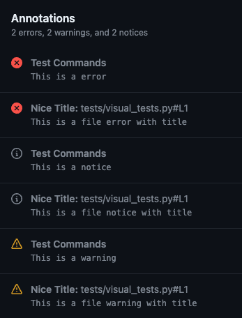

# Github Actions Utils


[](https://github.com/heitorpolidoro/github_actions_utils/releases/latest)

<br>
[](https://sonarcloud.io/summary/new_code?id=heitorpolidoro_github_actions_utils)<br>


Github Actions Utils is a Python library to help creating actions

---
## Messages
### `debug(message)`

### `notice(message, title=None, file=None, line=None, end_line=None, col=None, end_column=None)`

### `warning(message, title=None, file=None, line=None, end_line=None, col=None, end_column=None)`

### `error(message, title=None, file=None, line=None, end_line=None, col=None, end_column=None)`

Write messages in the Action log, annotation or file 
[[GitHub Docs](https://docs.github.com/en/actions/using-workflows/workflow-commands-for-github-actions#setting-a-debug-message)]<br>
In the Action log:<br>


In the Action summary:<br>


In the Files changes when a file is passed as a parameter:<br>


Usage:
```python
from github_actions_utils import debug, notice, warning, error

debug("This is a debug")

notice("This is a notice")
notice("This is a file notice with title", title="Nice Title", file=filename)

warning("This is a warning")
warning("This is a file warning with title", title="Nice Title", file=filename)

error("This is a error")
error("This is a file error with title", title="Nice Title", file=filename)
```
---
## Group
### `start_group(name)`

### `end_group()`

### `group(name)`
Create a group log in Action log 
[[GitHub Docs](https://docs.github.com/en/actions/using-workflows/workflow-commands-for-github-actions#grouping-log-lines)]<br>


Usage:
```python
from github_actions_utils import start_group, end_group

start_group("Group title")
print("logs inside group")
end_group()

# OR
from github_actions_utils import group

with group("Group title"):
    print("logs inside group")
```
---

## Mask
### `mask(value)`
Masks some secret value to avoid beem printed in the log
[[GitHub Docs](https://docs.github.com/en/actions/using-workflows/workflow-commands-for-github-actions#masking-a-value-in-a-log)]<br>
Usage:
```python
from github_actions_utils import mask

mask("This is a mask")
print("Test This is a mask")
```


---
## Environment Variables
### `set_env(env_name, value)`

### `get_env(env_name, default=None, type=None)`
Set and get environments variables, writing and reading in the default environment and from `GITHUB_ENV` file
[[GitHub Docs](https://docs.github.com/en/actions/using-workflows/workflow-commands-for-github-actions#environment-files)]<br>

```python
from github_actions_utils import set_env, get_env

set_env("ENV_NAME", "env_value")
get_env("ENV_NAME")  # == "env_value"

get_env("ENV_DEFAULT", default="default")  # == "default"

set_env("ENV_INT", "42")
get_env("ENV_INT, type=int")  # == 42

set_env("ENV_BOOL", "true")
get_env("ENV_BOOL, type=bool")  # == True

```
---
## Output Parameter
### `set_output(name, value)`
Set an output value to be used in another steps
[[GitHub Docs](https://docs.github.com/en/actions/using-workflows/workflow-commands-for-github-actions#setting-an-output-parameter)]<br>

```python
from github_actions_utils import set_output

set_output("NAME", "Heitor")
```
---
## Summary
### `append_summary(message)`
### `overwrite_summary(message)`
### `erase_summary()`
Write content in the job summary
[[GitHub Docs](https://docs.github.com/en/actions/using-workflows/workflow-commands-for-github-actions#adding-a-job-summary)]<br>
```python
from github_actions_utils import append_summary, overwrite_summary, erase_summary

append_summary("This is a list")
append_summary("- item 1")
append_summary("""- item 2
- item 3""")

overwrite_summary("No more list")

erase_summary()
```
---
## System Path
### `add_system_path(path)`
Prepends a directory to the system PATH
[[GitHub Docs](https://docs.github.com/en/actions/using-workflows/workflow-commands-for-github-actions#adding-a-system-path)]<br>
