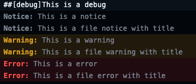

# Github Actions Utils


[](https://github.com/heitorpolidoro/github_actions_utils/releases/latest)

<br>
[](https://sonarcloud.io/summary/new_code?id=heitorpolidoro_github_actions_utils)<br>


Github Actions Utils is a Python library to help creating actions

---
### Log utils

### **`debug(message)`**
### `notice(message, title=None, file=None, col=None, end_column=None, line=None, end_line=None)`
### `warning(message, title=None, file=None, col=None, end_column=None, line=None, end_line=None)`
### `error(message, title=None, file=None, col=None, end_column=None, line=None, end_line=None)`
```python
from github_actions_utils.log import debug, notice, warning, error

debug("This is a debug")

notice("This is a notice")
notice("This is a file notice with title", title="Nice Title", file=filename)

warning("This is a warning")
warning("This is a file warning with title", title="Nice Title", file=filename)

error("This is a error")
error("This is a file error with title", title="Nice Title", file=filename)
```

In the Action log:<br>


In the Action summary:<br>


In the Files changes when a file is passed as a parameter:<br>


Group:
```python
from github_actions_utils.log import start_group, end_group

start_group("Group title")
print("logs inside group")
end_group()

# OR
from github_actions_utils.log import group

with group("Group title"):
    print("logs inside group")
```


Mask:
```python
from github_actions_utils.log import mask

mask("This is a mask")
print("Test This is a mask")
```


[//]: # (### Log Utils)

[//]: # (#### github group decorator)

[//]: # (```python)

[//]: # (from github_actions_utils.log_utils import github_group)

[//]: # ()
[//]: # (@github_group&#40;"foo"&#41;)

[//]: # (def foo&#40;&#41;:)

[//]: # (    code)

[//]: # (```)

[//]: # (Will produce in github action log)

[//]: # (```log)

[//]: # (▸ foo)

[//]: # (```)

[//]: # (You can use the function parameters as input like:)

[//]: # (```python)

[//]: # (@github_group&#40;"Running $cmd"&#41;)

[//]: # (def run&#40;cmd&#41;:)

[//]: # (    code)

[//]: # (```)

[//]: # (When your code calls the `run` function will print user the value from `cmd` parameter:)

[//]: # (```python)

[//]: # (run&#40;"nice command"&#41;)

[//]: # (```)

[//]: # (```log)

[//]: # (▸ Running nice command)

[//]: # (```)

[//]: # (Even if the value is an object and you want a value from the object attribute:)

[//]: # (```python)

[//]: # (@github_group&#40;"Hello $&#40;person.name&#41;"&#41;)

[//]: # (def hello&#40;person&#41;:)

[//]: # (    code)

[//]: # (```)

[//]: # (```python)

[//]: # (p = Person&#40;name="Heitor"&#41;)

[//]: # (hello&#40;p&#41;)

[//]: # (```)

[//]: # (```log)

[//]: # (▸ Hello Heitor)

[//]: # (```)
